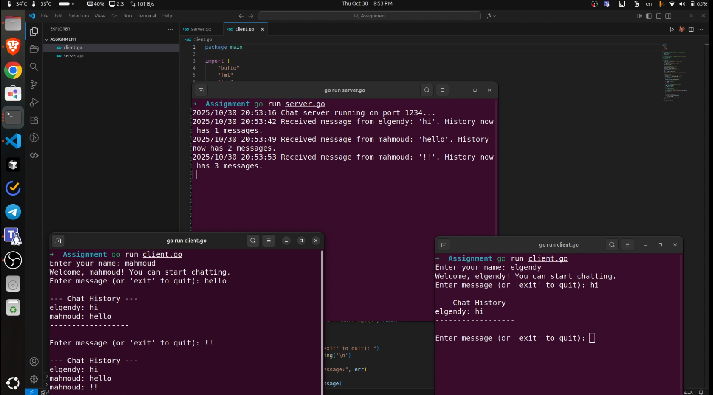

#  Go RPC Chat Application

A simple client-server chatroom application built with Go (Golang) and the `net/rpc` package. This project demonstrates the fundamentals of RPC, concurrent server handling, and state management using mutexes.

This was built as an assignment based on the requirements in `instructions.md`.

##  Features

* **Client-Server Architecture:** Uses Go's `net/rpc` library.
* **Persistent Chat History:** The server maintains a complete history of all messages.
* **Multiple Clients:** The server uses `go rpc.ServeConn(conn)` to handle multiple clients concurrently.
* **Concurrency Safe:** The chat history is protected by a `sync.Mutex` to prevent race conditions.
* **Graceful Exit:** Clients can type `exit` to leave the chat.

##  Technologies Used

* **Go (Golang)**
* **Standard Libraries:**
    * `net/rpc` (for remote procedure calls)
    * `net` (for TCP listener)
    * `sync` (for `Mutex`)
    * `log` (for server-side logging)
    * `bufio` (for reading full-line client input)

## DEMO

Here is a screenshot of the server and two clients running concurrently:



##  How to Run the Project

You will need to open 2 or more terminal windows.

### 1. Run the Server

In your first terminal, start the server:

```bash
go run server.go
```

**Output:**
```
2025/10/30 21:00:00 Chat server running on port 1234...
```

### 2. Run the Client(s)

In a second terminal, run the client:

```bash
go run client.go
```

You will be prompted for your name. You can open a third, fourth, etc., terminal and run `go run client.go` again to have multiple users join the chat.

**Client 1 Output:**
```
Enter your name: mahmoud
Welcome, mahmoud! You can start chatting.
Enter message (or 'exit' to quit): hi
--- Chat History ---
mahmoud: hi
Enter message (or 'exit' to quit): 
```

**Client 2 Output:**
```
Enter your name: elgendy
Welcome, elgendy! You can start chatting.
Enter message (or 'exit' to quit): hello
--- Chat History ---
mahmoud: hi
elgendy: hello
Enter message (or 'exit' to quit): 
```
